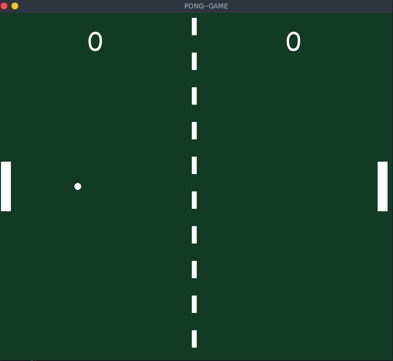
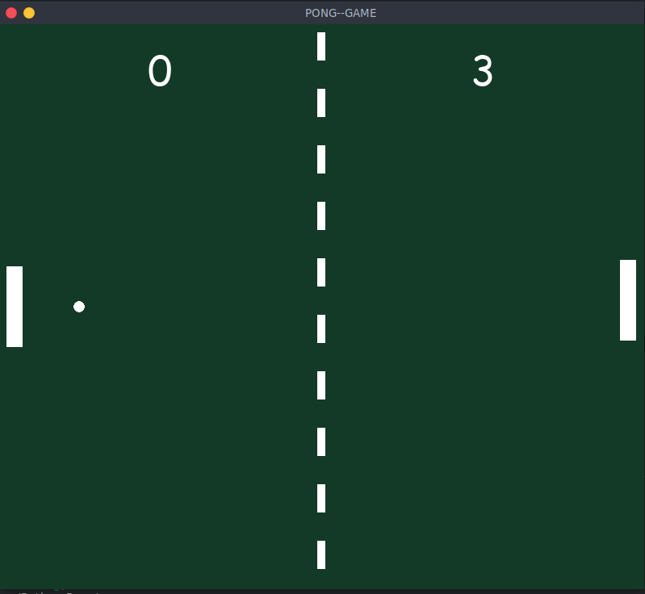
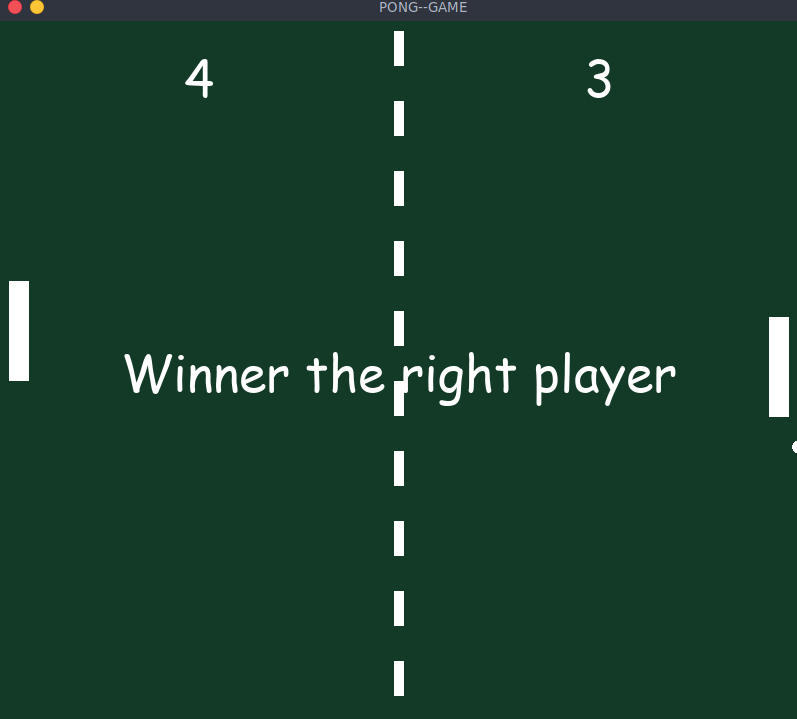

# Pong Project in Python
-----

## This application is about the popular game pong. Using differents class to represent the ball, the paddles and the background screen.

---------------------------------

### **Created by Userlg developer**

------------------------------------------------

# Requirements

+ Knowledge about class and objects

+ Python 3.10

+ Pipenv

+ Pygame

+ Colorama

#  Controls and Settings by default
---------------------------------------------

+ Player 1 --> W to Up and S to Down

+ Player 2 --> Arrow Up to Up and Arrow Down to Down

+ Max Score 5

+ The game will reset when one of two players have 5 points

# Respositoy Link

[Link](https://github.com/userlg/Pong-Python)

# Screenshots 
--------------------------------------------------

-------------------------------------------------

--------------------------------------------------

----------------------------